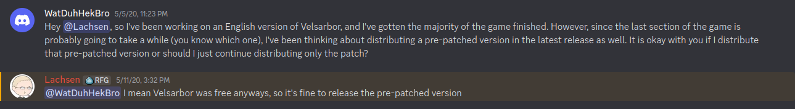

*This document contains extra info that isn't necessarily required for the player's experience. This helps declutter the front page document.*

# Extra info about the game

## Controls

*Useful for controller usage.*

There are only three true controls for the game. Movement, Select, and Back. In the game, these'll be referred to as `the arrow keys`, `Enter`, and `Esc` respectively.
- Movement is controlled by the `arrow keys` and is self-explanatory.
- `Select` is the key used to select a menu option as well as to run/walk when you hold the key. This key is `Z` as well as `Enter`.
- `Back` is the key used to cancel a menu option as well as to open/close the menu. This key is `X` as well as `Esc`.

These buttons below still do unique things, but are mostly for customization.
- `F4`: This toggles whether or not you play in fullscreen.
- `F5`: This toggles whether the game upscales by a factor of 2 or keeps the original ratio. 320x240 and 640x480 are the available resolutions.
- `F12`: This brings you back to the title screen **regardless of whether or not you saved or where you are**.

## The List of Gotchas

There are several pieces of information about the game which is nowhere to be found inside the actual game itself, making it annoying to not know about. Here's a list of all these points so you don't have to go through that same headache:
- When a character reaches LvL 10, they'll get their second combat art.
- When a character reaches LvL 20, they'll start off each battle with 1 SP.
- If you use magic lens to analyse a boss, you'll just get a bunch of question marks because lo and behold, you actually have a wait a couple of turns first.
- `Great <element>` spells are improved versions of its base spell, still single-target. The reason these have a `3` in their appearance is because you need to have 3 SP in order to cast these. These spells don't consume said SP though.
- Any unused SP gets converted into an equal amount of MP at the end of battle, indicated by the yellow number by the character.
	- Example: If a character has 5 unused SP, then that character gets +5 MP.

## Pronunciations

- Cibon: Pronounced with a hard C, so basically "Key-bon". The stress is on the first syllable.
- All J's are pronounced as Y's, because German. The exception is with Japanese-esque names.

# Existing Translations

## Regarding the French Version

For many years now, there has been a [French version of Velsarbor](http://www.rpg-maker.fr/jeux-418-velsarbor-version-francaise.html) [by Shanka](https://www.rpg-maker.fr/index.php?page=forum&id=5080). This page at least seems to be based on the first demo of Velsarbor, which you can tell by the number of maps. The first demo has 180 maps while the second/final demo has 296 maps. I'm not sure if saves transfer, though I can't see any reason why they wouldn't. There are a few maps I know of that have completely changed their dialogue, but it seems like they're far and few between.

## Any other English translations?

AFAIK, the people who previously worked on translations never published their progress, and it seems like they haven't worked on it since.

# Velsarbor Website

- **Original Website:** http://velsarbor.rpg-atelier.net/
- Got taken down sometime between 2014-02-07 (the last snapshot available in the Wayback Machine) and 2014-08-15.

# Permission to Redistribute

*Radical Fish Games Discord (formerly CrossCode Discord)*

# Videos & Let's Plays

I have a playlist of update videos in case you want to watch it instead of playing it, [here](https://www.youtube.com/playlist?list=PLT800wgkhxolwCulnS8bWs9LVEPnssTgy). Keep in mind that I'm cutting out regular battles since they're boring to watch.

These are the two trailers for the game:
- [4 minute trailer](https://www.youtube.com/watch?v=ZuqRkeXgYHQ)
- [8 minute trailer](https://www.youtube.com/watch?v=YdjZXLk1sF8)

Here are some references:
- [TrueMG](https://www.youtube.com/playlist?list=PLEED9E15CB6E0D597) (First Demo, the entire game)
- [TrueMG](https://www.youtube.com/playlist?list=PLSgi0v-Xd3aGWEzfvjlh2gbqLF_cllSq_) (Second/Final Demo, up to the end of Nomerea)
- [MajinSonicLP](https://www.youtube.com/playlist?list=PLxdruDpgzoSHWmU5xxbEkfbF5dtemyDeN) (Second/Final Demo, the entire game)
- [Tsuyoshi](https://www.youtube.com/playlist?list=PLMP3JOKdupbZ-erFuW239eLVM5TasXRMi) (Second/Final Demo, the entire game & he seems to have 100%'d it too)

And let's not forget the video that started it all: [The video by Hydlide S](https://www.youtube.com/watch?v=LNBnLKQmUmQ)
